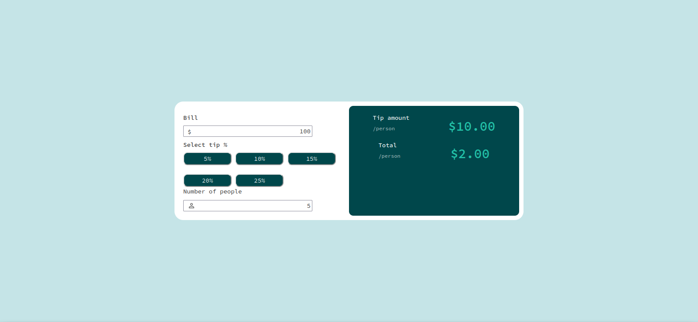

# calculadoraTipsJS
Ejercicio de clase: 
 

  

 

En este preoyecto muestro una simple calculadora hecha con las tres tecnologias (html, css y JavaScript) donde introduces lo que ha costado la comida/cena pones el porcentaje de tip y el numero de personas y te lo calcula.

<h3>algunas imagenes </h3>

